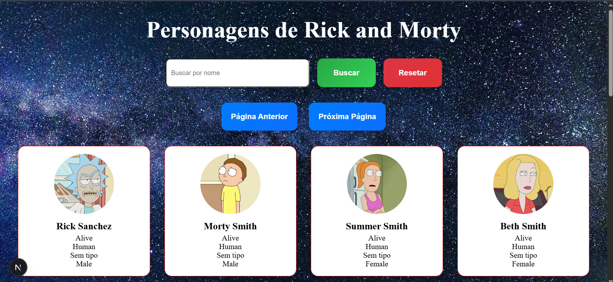
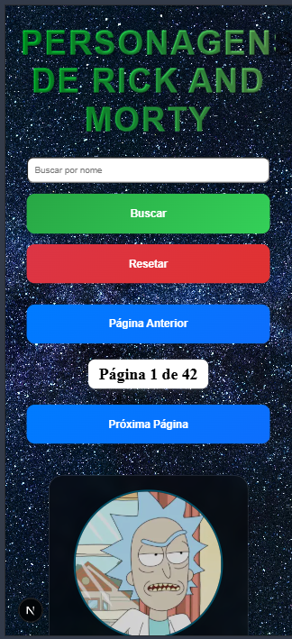

# 🌌 Rick and Morty Front-End (Next.js)

Interface web construída com Next.js que consome a API do universo de Rick and Morty! Explore personagens, episódios e localizações com uma navegação rápida e responsiva.

## 📸 Demontração da API 

  
   
  Versão para Desktop
    
  
   
  Versão para Mobile

## ⚙️ Tecnologias utilizadas
Next.js (React)

Axios

Tailwind CSS

React Icons

API pública ou customizada do Rick and Morty

## 🚀 Instalação
Clone o repositório:

git clone https://github.com/PedroLeoo07/Front-End_RM-api

cd Front-End_RM-api

npm install

## ▶️ Inicie o projeto
npm run dev

## 🌐 Funcionalidades
✅ Listagem de personagens com imagens e dados principais

🔍 Filtros por nome, status, gênero (se aplicável)

📄 Página de detalhes de personagens

📺 Página de episódios

🌍 Página de localizações

🔄 Paginação com rota dinâmica ([id].jsx)

## 📌 Notas

Este projeto é ideal para praticar habilidades com Next.js, incluindo o uso de rotas dinâmicas e consumo de APIs REST. Além disso, pode ser expandido para explorar técnicas avançadas como Server-Side Rendering (SSR), Static Site Generation (SSG) ou Incremental Static Regeneration (ISR).

Com um design responsivo e foco em performance, este projeto oferece uma excelente oportunidade para aprimorar conhecimentos em desenvolvimento front-end moderno.

## 🤝 Contribuições
Contribuições são sempre bem-vindas! Sinta-se à vontade para abrir uma issue para relatar problemas, sugerir melhorias ou discutir novas ideias. Caso queira colaborar diretamente, envie um pull request com sua proposta. Vamos construir juntos!

## 📄 Licença
Este projeto está licenciado sob a licença MIT. Consulte o arquivo [LICENSE](./LICENSE) para mais informações.